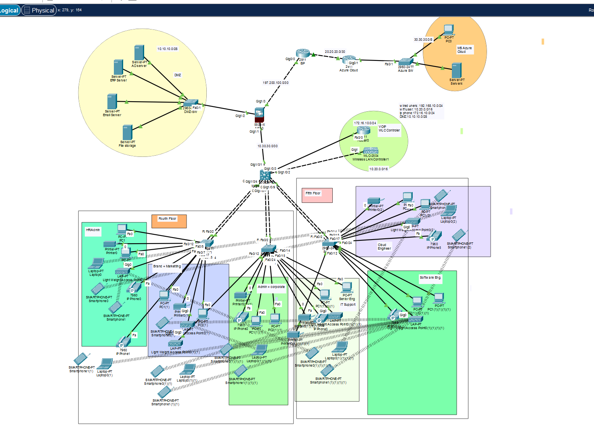

# Enterprise Telecommunication Network Design

## 🖼 Network Topology

---

## 🔍 Overview
Designed and implemented a secure enterprise-level telecommunication network based on a hierarchical architecture (Core, Distribution, Access layers).  
The network supports data, voice, and wireless services with high availability and security.

This project simulates a real enterprise environment using industry best practices for scalability, performance, and security.

---

## 🏗 Architecture
- Core Layer – High-speed backbone routing
- Distribution Layer – VLAN routing, policies, and security
- Access Layer – End-user connectivity (PCs, IP phones, wireless devices)

---

## 🧠 Key Features
- Hierarchical Network Design (Core / Distribution / Access)
- VLAN Segmentation (LAN, WLAN, VoIP)
- Inter-VLAN Routing using Multilayer Switch (SVI)
- Dynamic Routing with OSPF
- Cisco ASA Firewall (NAT, ACL, Security Policies)
- Wireless LAN Controller (WLC) with Lightweight Access Points
- VoIP Implementation (Cisco 2811 Voice Gateway)
- DHCP Configuration (Data & Voice)
- EtherChannel (LACP)
- STP PortFast & BPDU Guard
- DMZ Setup (ERP, Email, File Server)
- Secure SSH Remote Access with ACL
- Azure Cloud Connectivity

---

## ⚙️ Technologies Used
- VLAN
- OSPF
- DHCP
- NAT
- ACL
- VoIP
- Cisco ASA Firewall
- Wireless Networking

---

## 🛠 Tools
- Cisco Packet Tracer

---

## 📂 Project Files
- 🖼 Network topology diagram (Project.PNG)
- ⚙️ Configuration files

---

## ⚠️ Challenges & Learning
- Designing scalable enterprise architecture
- Implementing VLAN segmentation and inter-VLAN routing
- Configuring OSPF across multiple layers
- Integrating security (ACL, Firewall, DMZ)
- Combining VoIP, wireless, and data networks

---

## ✅ Outcome
This project demonstrates practical skills in enterprise network design, routing, switching, security, and VoIP implementation aligned with CCNA-level networking concepts.
